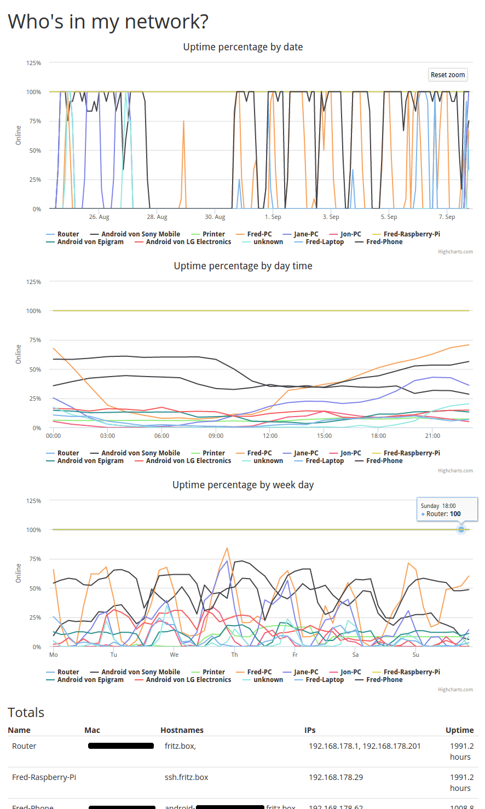

# nmap-log-parse

Logs which devices are in your local network and draws graphs

Screenshot:



## Setup

1. Clone this repository and checkout the precompiled branch

    ```bash
    git clone https://github.com/phiresky/nmap-log-parse
    cd nmap-log-parse
    git checkout gh-pages
    ```

2. Add this line to your **_root_** crontab on your raspberry pi (or other device that is always on):

    `*/10 * * * * nmap -sn '192.168.178.*' -oX - >> /var/www/nmap-logs/$(date -I).xml`

    You can edit the root crontab by running something like `sudo EDITOR=nano crontab -e`

    Replace `'192.168.178.*'` with your network range and `/var/www/nmap-logs/` with the target location.

    This takes about ~10MB of storage per month.

    **The above command _must_ be put into the root crontab!**
    Otherwise, nmap can't read mac-addresses and the output will be wrong.

3. create a `config.json` file in the same folder as the built `index.html` is in (dist),
   overriding any of the values in the [default config](./config.ts).

    for example:

    **config.json**

    ```json
    {
    	"logFilesPath": "/nmap/logs/",
    	"staticLogFiles": ["logs/oldlogs"],
    	"deviceNames": {
    		"AB:CD:EF:01:23": "John's PC"
    	}
    }
    ```

    Use `staticLogFiles` only if you have an undated log file from an older version.
    
    The logFilesPath is either relative to the root dirctory of the server (if starting with /) or the built index.html file (otherwise)

4. Wait more than an hour. Make sure the first log file (in the form 2019-06-29.xml) exists and contains XML documents.
5. Open `index.html` in a browser. Open it from a server (like a minimal `python3 -m http.server`) instead of from the filesystem because of Cross-Domain security.

## Contributing

Made with [React], the [Dexie.js] database and [Highcharts].

Get the dependencies using `yarn install`, then run `yarn dev` to build.

This project is written in [TypeScript], which is basically JavaScript (ES6), but strongly typed. I can recommend [Visual Studio Code][vsc] (on linux) for IntelliSense and Refactoring support.

If you have ideas to make this better please open an issue, or even better, send a pull request.

[typescript]: https://www.typescriptlang.org
[react]: https://facebook.github.io/react/
[dexie.js]: http://dexie.org/
[highcharts]: http://www.highcharts.com/
[vsc]: https://code.visualstudio.com/
